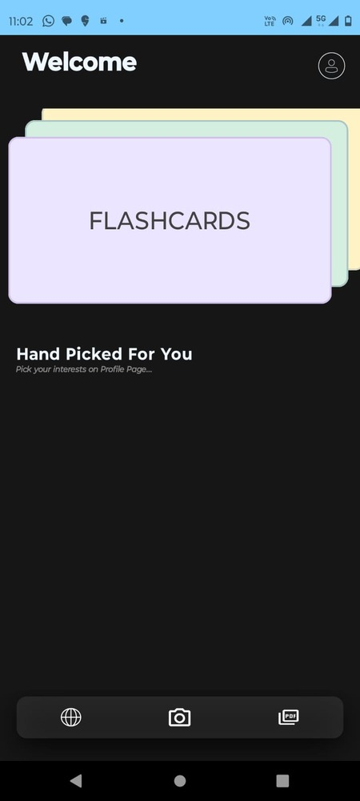

# PagePal

## Introduction
PagePal is an Android mobile application designed to enhance reading and comprehension across various formats, whether you're dealing with physical books, research reports, textbooks, or digital content. Built with Jetpack Compose and Kotlin, this app leverages Google's Gemini genAI model to provide instant definitions, summaries, and intelligent image interpretations directly from your mobile device.

## Features
- **Home Page:** When you open the app you see this page and you can then navigate to your desired location.
  
- **Instant Definitions:** Tap any word in a scanned page to see its meaning immediately.
- **Content Summaries:** Get concise summaries of pages or selected text extracts.
- **Image Interpretation:** Upload any image (not limited to text or diagrams) to receive an AI-driven explanation of its contents.
- **Integrated ChatBot:** Engage in conversations on any topic, or discuss uploaded images and text extracts directly through the app.
- **PDF Viewer:** Open and interact with PDFs stored on your device, accessing all app features like meanings and summaries.
- **Web View:** Browse any website and utilize the app’s features without needing to download content.
- **Offline Saving:** Save definitions, summaries, and chat histories with custom titles for easy access later.

## Getting Started

### Prerequisites
- Ensure you have Android Studio installed to open and run the project.
- An Android device or emulator running Android API level 21 (Lollipop) or higher.

### Installation
1. Clone the repository:
2. Open the project in Android Studio.
3. Build the project by selecting `Build -> Make Project`.
4. Run the app on a connected Android device or emulator by selecting `Run -> Run 'app'`.

## Usage
1. **Scanning Text from Physical Books:**
- Use the camera feature to take a picture of the page.
- Tap any word to see its definition or select text to generate a summary.

2. **Interacting with PDFs:**
- Load a PDF from your device.
- Use similar interactions as with physical pages.

3. **Online Content Engagement:**
- Navigate to a website using the web view feature.
- Engage with the text using the app's functionalities in real-time.
  
## Project Status
This app is currently in development and is intended for private use within our development team. The repository is private, and the app is not open for public contributions or use.

## Acknowledgments
Special thanks to all team members for their contributions and dedication to the project.

## Disclaimer
This application is developed for educational purposes and internal project use only. It is not intended for commercial distribution or use.

